## Github account anlegen

## Github Desktop installieren

Mit dem Github Account verbinden

## R-Studio Integration

-   Tools –\> Global options –\> Git / SVN

-   Github aktivieren

-   Create SSH-Key

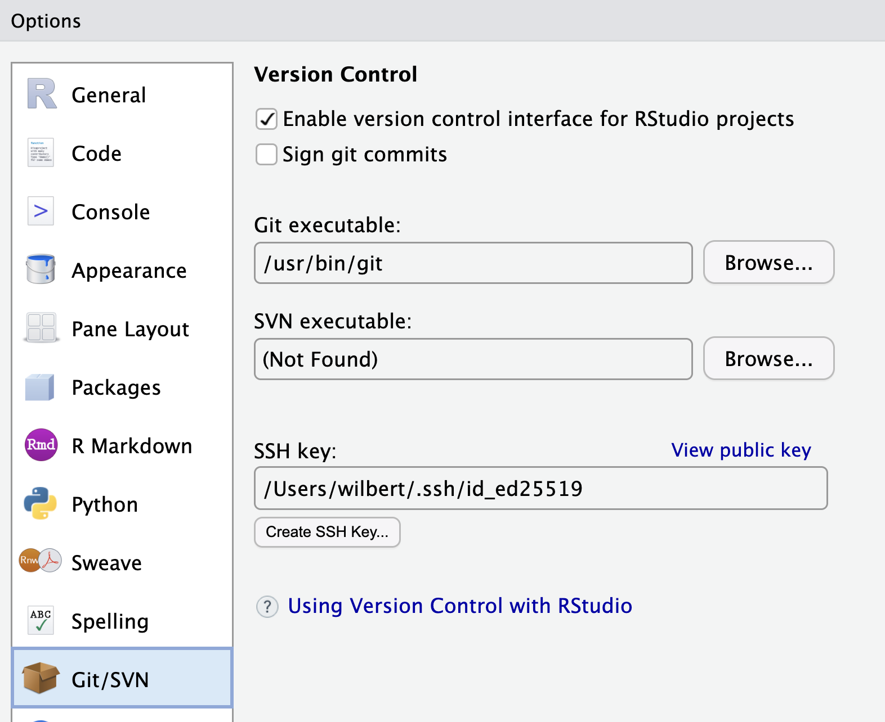{width="408"}

-   In Github —\> settings –\> SSH and GPG Keys

-   New SSH Key / Key titel / Copy Key / Add key

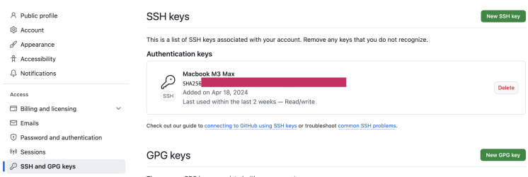

## Repo anlegen

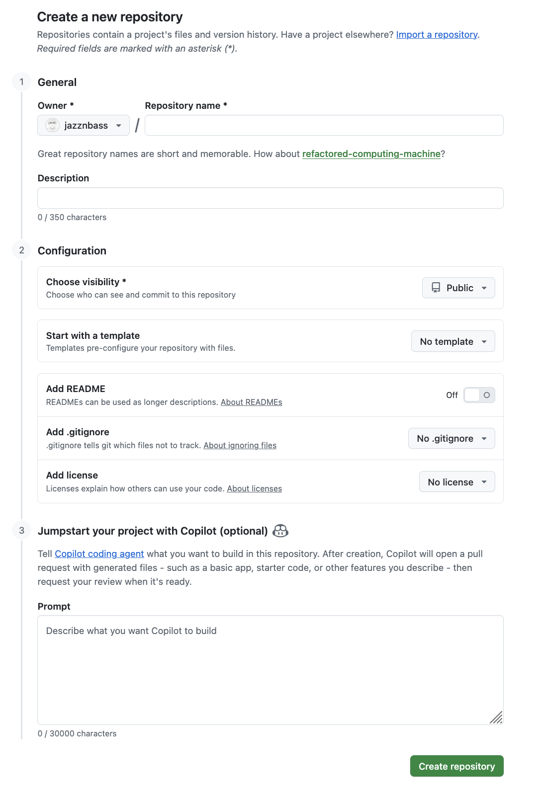{width="1358"}

## Download eines Repos auf den Rechner

Github Desktop –\> File –\> Clone Repository -\> \[enter repo name\] -\> Clone

Rstudio -\> File –\> New project -\> open in new session anklicken -\> Existing directory -\> Folder auswählen

Sicherstellen, dass in RStudio "Show Hidden Files" aktiviert ist:

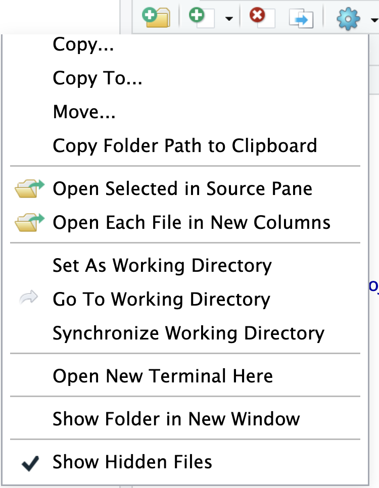{width="274"}

Unterordner .git Datei Config öffnen:

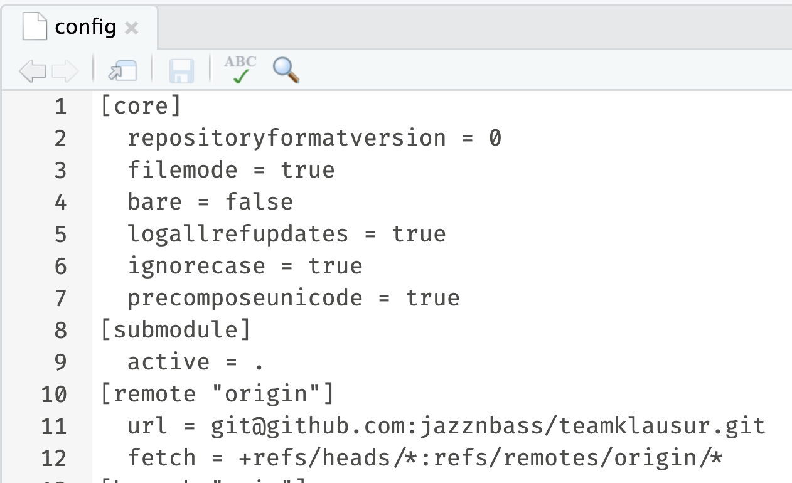{width="522"}

Dort muss unter \[remote "origin"\] eine andere url eingetragen werden.

Die hat die folgende Form: git\@github.com:\[benutzername\]/\[reponame\].git

Alternativ:

In Github im Repo kopieren:\
\
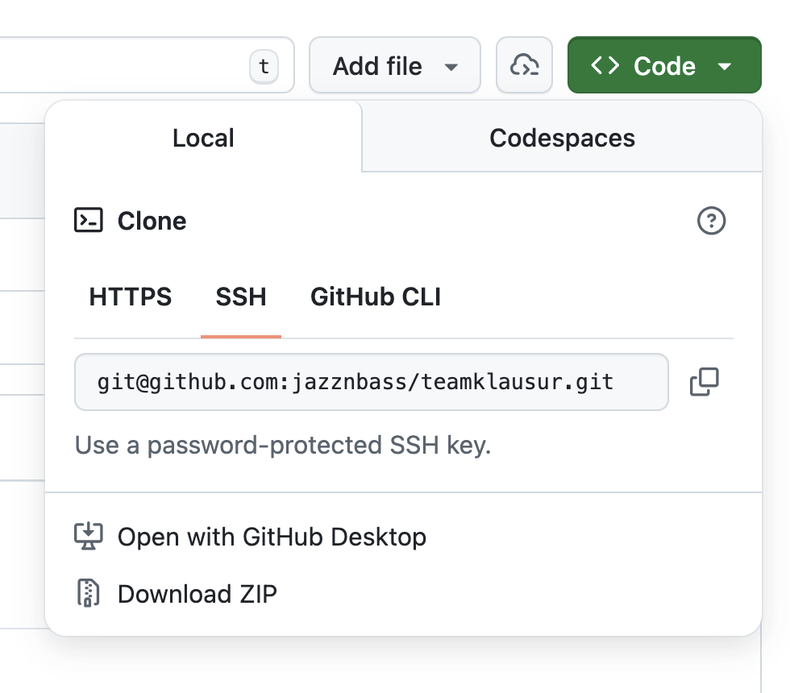{width="497"}

## Commits

Öffne die Readme.md Datei und ergänze ein paar Infos:\
\
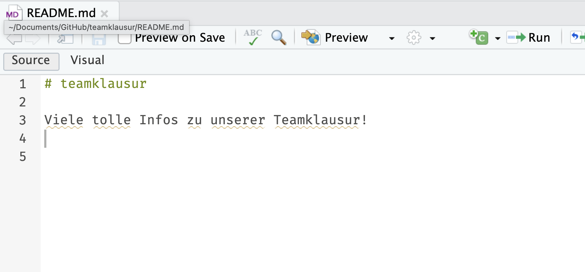

Commit auswählen

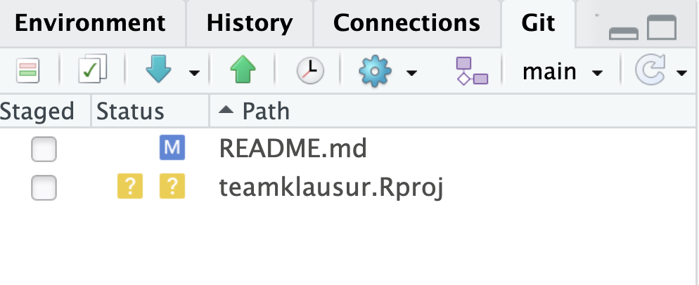{width="467"}

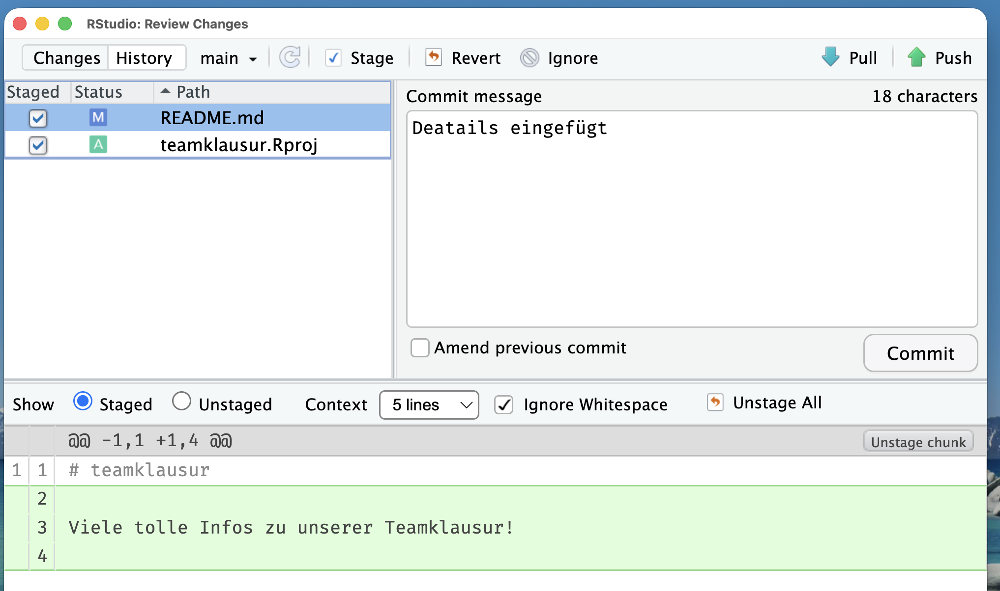

### ⚠️ Pull: Damit werden Daten aus dem Repo in Github heruntergeladen und synchronisert!

### ⚠️ Push: Mit Push werden die Commits ins Repo auf Github hochgeladen. Vorher nicht! Ohne Push sind die commits (nur) lokal auf Eurem Rechner vorhanden.

## Branches

-   Sind eine Kopie aller Daten um darin sicher Veränderungen auszuprobieren

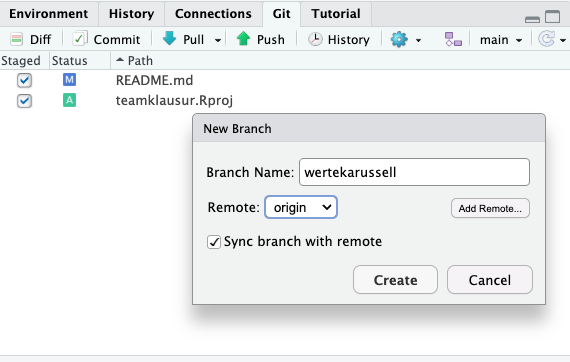

In dem neuen Branch wir dann normal weitergearbeitet inklusive commits, Pushs und Pulls:

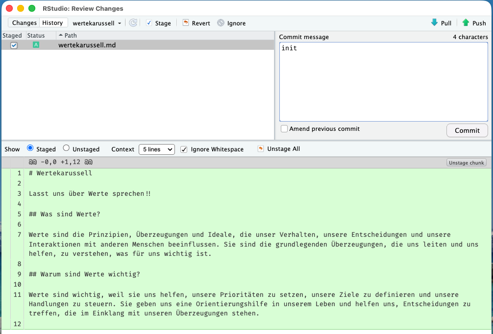{width="934"}

## Pull requests

Wenn man die in einem Branch gemachten Veränderungen wieder übernehmen will z.B. in den Hauptbranch, dann erstellt man einen Pull request:

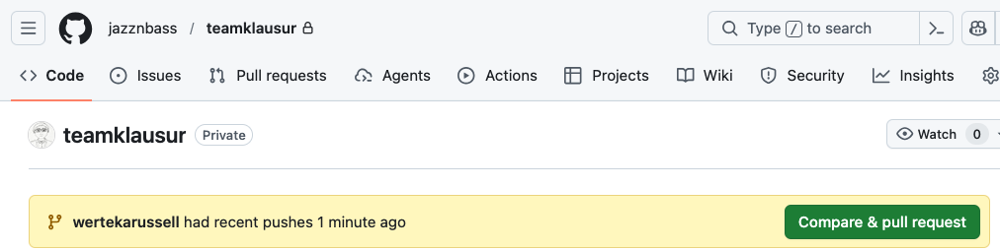

## 

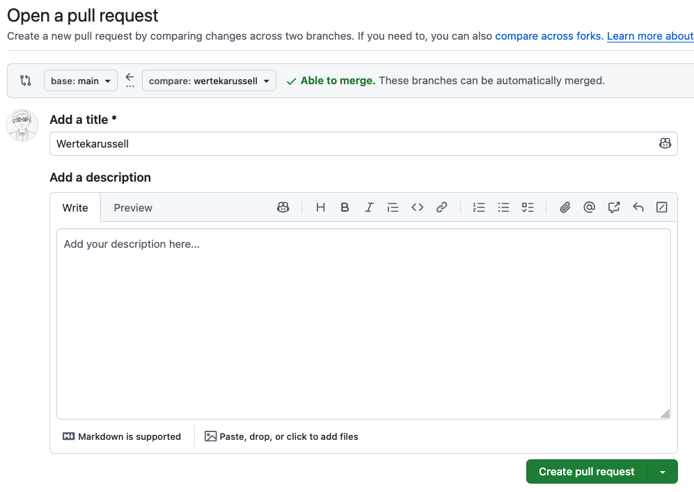

## 

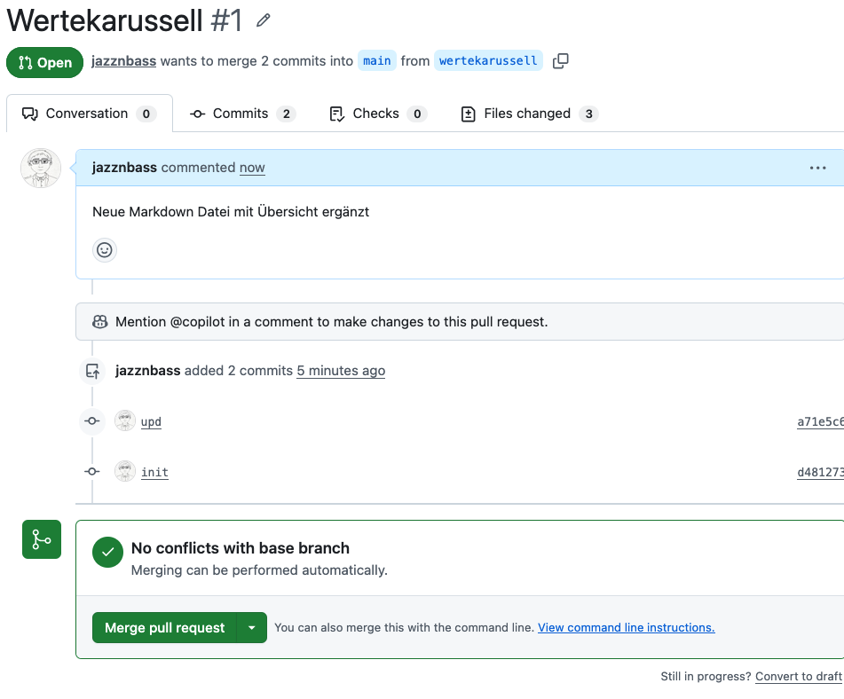
